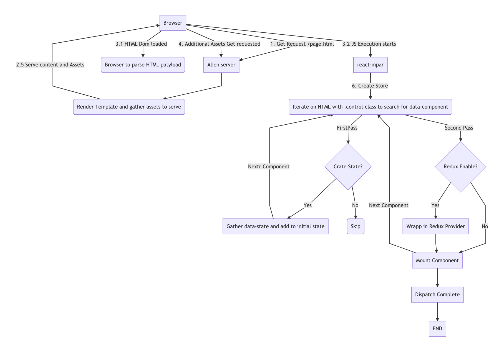

# React MPAR: React Multipage Application Renderer

### Context
**Why React MPAR?**
A very common problem in modern frontend development with react is how to achieve progressive enhancement on sites or web apps where legacy CMS's or web platforms are in place. This is particularly challenging because we need to synchronize server-side alien render from backend with front end rendering with react. At the same time, it may be in the interest of the project to allow the coexistence of legacy server-side rendered (SSR) content from backend with interactive frontend rendered content.

A very common approach to bringing a solution to this problem is [web components](https://www.webcomponents.org/). In a nutshell, web components leverage custom XHTML tags in order to generate micro frontend applications that enhance the standard capabilities of a site with "custom reusable smart/complex components". Is important to clarify that the reusability and complexity aspects of these components may depend on backend services to be put in place so these will not be straight forward that you may expect, however, will enable the inclusion of modern frontend frameworks like react and all its ecosystem/community.

## TODO
- Create build for SSR
- Determine how to share both React in the same library
- Document SSR do not use Async to simplify
- demo SSR with JSDOM
- document SSR process
- split docs into multiple files
- document package.json scripts
- unit test ReactMPAR

## How it works?
In order to understand how React-MPAR works please consider the following graph.



Lets now take a look to the render process, first the client makes a request via the browser to the alien CMS or Web Platform (1), this web app example AEM, CMS, Drupal, Magento, Wordpress; or any other  will gather the necessary templates an assets based on the path requested example **/route/page.html** and will return back (2) this resources back to the browser via classic HTTP transport. In Web architecture principles for integration projects "The glass" this is where the web platform resolves the URL and retrieves the necessary HTML markup to be delivered to the browser.

Once the initial HTML payload is received by the browser and the HTML Dom (3.1) is initialized in the browser, the natural behavior of these ones is to generate sub sequents HTTP/HTTPS requests (4) to load additional assets needed to render the HTML; example of this assets are CSS, 1st, 2nd and 3th party Js libraries, etc; but most important our App bundles/libraries with React-MPAR.

Immediately after our app withReact-MPAR gets loaded by the browser, the js execution starts (3.2) and the rendered engine will first create the redux store by iterating on the HTML using the control class to search for the HTML elements that are supposed to be replaced by React components.

Let us consider the following HTML markup and make the assumption has been generated by the SSR CMS or Web platform.

```html
<!DOCTYPE html>
<html>
  <head>
    <title>The Minimal React Webpack Babel Setup</title>
  </head>
  <body>
    <div class="bx--grid">
        <div class="bx--row">
            <div class="bx--col">
                <h1>Welcome to React Redux MPA Renderer</h1>
                <p>This is Static HTML, Which has been generated by SSR and wont be replace by react</p>
                <hr />
                <div
                  class="mpar-controller-class"
                  data-component="TestComponent"
                  id="unique_id_1_for_sync_component"
                  data-props="eyJ0aXRsZSI6IlN5bmMgVGVzdCBjb21wb25lbnQiLCJjb3B5IjoidG
                  hpcyBjb21wb25lbnQgaXMgYnVuZGxlIGluIHRoZSBtYWluIGVudHJ5IHBvaW50IG9mIHRoZSBhcHAifQ=="
                ></div>
                <div
                  class="mpar-controller-class"
                  data-component="AsyncTestComponent"
                  id="unique_id_2_for_async_component"
                  data-props="eyJ0aXRsZSI6IkFzeW5jIFRlc3QgQ29tcG9uZW5
                  0IiwiY29weSI6IlRoaXMgaXMgYSBzb2NvbmQgcHJvcCBmcm9tIGJhY2sgZW5kIn0="
                ></div>
            </div>
        </div>
    </div>
    <script src="./index-bundle.js"></script>
  </body>
</html>

```
In the above markup we need to focus our attention on the following elements:

**a. HTML Target Element:** The HTML Div element with the class on it ".mpar-controller-class". This element is what we are going to reference as target element. The controller class in this example is "mpar-controller-class". On React-MPAR this class is the first argument when constructing the renderer. The name of this class can be defined by the developer and is tied to the strategy of bundles and code splits.

```
const renderer=new ReactMPAR(".mpar-controller-class",dictionary,document);
```
Lets keepo the focus on this HTML element:

**b. Data Attribute component:** `data-component="TestComponent` the following HTML attribute is must likely the must important attribnute to be defined and instructing React-MPAR what component inside the dictionary provided to the renderer has to be render in the target element.

**Attention:** if the component is not present in the dictionary React-MPAR will throw an error failing to initialize, something that will always need to keep in mind is that we cannot roll off backend components without the frontend counterpart.

**c.Data Attribute Props:** `data-props="e2NvbG9yPScjY2NjJ30="` the following HTML attribute is the second key aspect of React-MPAR. So far we understand how we instruct what component we need to render with component attribute now we need to provide to react what content exactly we need to render inside the desired component. To achieve this we will use data-props which contains all the necessary props for the initial render of the component.

You may notice that the content of this attribute may look a bit strange this is because what we are looking at is a base64 encoded JSON object to avoid encoding issues between platforms. If we were to decode the string *e2NvbG9yPScjY2NjJ30=* the result will be:`{color:'#ccc'}`. This JSON Object "the contract", is what we going to use to communicate data from the backend platform to the frontend renderer.

An important aspect of the data-props attribute is that it can be generated by any backend means possible or required. From hardcoded elements (a tool to generate this is provided as part of React-MPAR "/development/generate.html"), to a more clever approach where is generated by the results of CMSs or web platforms configurations forms within the page template, page model or any other widget/content-slot/content-block or even any other means provided by the backend platform.

**d. Data Attribute State:** `data-state="e30="` Following the same principles of data-props this attribute will contain a base64 encoded JSON object (contract), the only difference is the role that this data plays into the integration. For React-MPAR the centralized state method of choice is [Redux](https://redux.js.org/basics/usage-with-react) and [Flux](https://facebook.github.io/flux/) principles.

**Important**: This is an opensource project so feel free to fork this if you desire to change the centralized state principles to another library like [MobX](https://mobx.js.org/getting-started.html) or [React hooks](https://reactjs.org/docs/hooks-state.html) and/or [React context](https://reactjs.org/docs/context.html).

**Attention** the usage of a centralized state is completely optional and will depend on the required use cases that need to be implemented.

We can initialize our store with an initial state and the data attribute is aiming to do exactly that, so we can create the store with an initial state data that comes from the CMS or Web platform. This approach will allow the delivery of an initial payload without the need for an initial API call to populate time 0 or comonentDidMount lifeCycle data.

Now that we understand the key elements from the HTML markup, let us go back to the render process. In the step (3.2) of the above graph, we waited for our app bundle/lib to get downloaded and initialized. Once our Bundle/lib entry point gets initialized and JS starts to be executed by the browser, the first step that gets executed is `ReactMPAR.createState`. **optional**. This method will merge a preloaded state to be pass as a parameter to React-MPAR, with the ones from the components to be rendered.

To achieve the above, React MPAR search the target dom (6 and 7 on Graph) for any element with the controller class and extract the data-state attribute, to then decode it and merge to the preloaded state object to return a single JSON object that has all the preloaded states of the different components of the page. Once we have the initial state from the process above we then create a centralized Redux store using standard redux procedures. This store then gets passed to the instance of Redux enabled components that drive our application with the method `setStore`. You can know more at React-MPAR and redux enable components at the dictionaries documentation.

Up to this point, redux is already setup and we have our centralized store ready to go. The next step of the render process is to actually Mount the components in the **target element**. To achieve this, React MPAR  will loop through each of the elements based on the controller class and matching the data-component attribute to the dictionary. Then the renderer will mount each of the components in the target div, passing the decoded props and the global store if the component that is being rendered has redux enabled. (step 8 in Graph 3).

Now that we have gone through all the explanation of the render process and what is the capability that React-MPAR brings into mix, let us see some example code within the context of React entry point:

```js
const reactMPAR= new ReactMPAR(
    ".mpar-controller-class",
    dictionary,
    document
);
let preloadedState = reactMPAR.createState({});
const store = createStore(preloadedState);
reactMPAR.setStore(store);
reactMPAR.renderAll();
```

## Documentation
#### Controller Class
A controller class is a css class name that will be added to all the html element (ideally divs)  elements into the HTML page/dom that will then be scanned by React-MPAR to then treat them has a target element.

#### Target Element
A target element is HTML element (ideally divs) which has the following attributes:
**Mandatory**
- **id**: a CMS or web platform generated unique id in the dom. HAS TO BE UNIQUE not 2 elements in the same dom can have the same id.
- **class:** the controller class which makes the HTML element into a React-MPAR target element. An additionals classes can be added for CSS presentation.
- **data-component**: Component name to be mounted. This one has to exist into the root props of the dictionary object.
- **data-props**: This is the initial props from the CMS or Web Platform, is a base64 encoded string of a serialized JSON object that will contain the initial payload of props that will get passed to the component for rendering. This props is mandatory at least with an empty object `'{}' //ENCODED-> 'e30='`

**Optional**

- **data-state:** Only required if a state is required to be passed from backend and the createState is set to true in the dictionary. Same has props this is a base64 encoded string of a serialized JSON object that will contain the initial payload to be used as an initial preloaded state very useful to pass backend driven sessions data.

#### Dictonaries
A dictionary is a list of components available to the React-MPAR rendered that can be mount into a page into the target element. The dictionary is defined as a static JS object where each of the root properties will be the name of the component to be used into the data-component attribute.

There are 2 main types of components sync components which are imported to the dictionary as a normal ES6 import and will be bundled together into the bundle/lib entry point of the webpack build process. The other type will are async components, this will leverage the [webpack dynamic import](https://webpack.js.org/guides/code-splitting#dynamic-imports) functionality to auto-split this component into a separated chunk so this js/css asset is only loaded if the component has to be rendered into the page.

You can differentiate these 2 types of components in the below example of a dictionary where the sync component uses the class property and the component creator class/function for react is mapped directly to it. In the other hand for async components, the **import** function is mapped to the property classLoader.

**Important**: Do not use class and classLoader together into a definition of the same component only one at any giving time per component can be used.


```js
const dictionary = {
    AsyncTestComponent: {
        classLoader:()=>import("./AsyncTestComponent"),
        name: "Async Test React Component",
        description: "This is a standalone react component can be either a single functional component or a complete SPA",
        reduxEnabled: false,
        createState: false,
    },
    TestComponent: {
        class:TestComponent,
        name: "Test React Component",
        description: "This is a standalone react component can be either a single functional component or a complete SPA",
        reduxEnabled: false,
        createState: false,
    },
};
```

- **class**: React class component or functional component, the component has to be imported into the dictionary file before defining the object.
**or**
- **classLoader (es6 import function)** pointing to the relative path of the  React class component or functional component .js file.

In addition to the most important property class/classLoader, there are other mandatory props that are required to be defined:

- **name (string)** This is a human-readable name of the component.

- **description (string)** This is a human-readable description of the component

These two properties are not used directly at runtime, however, can be used to pass to a wrapper only available within the editor env of the CMS or Web platform.

- **reduxEnabled (bool)** determine if redux is enabled to the component, if true this will wrap the instance of the rendered component with the react-redux Provider component and pass the React-MPAR previously set store. **Important:** Please be aware that only 1 instance of each component can be added to the page if redux is enabled unless you do your own centralize state implementation or you can share the same root level entry for all the instance of the component on the page.

- **createState (bool)** determines if an initial state has to be created. If true React-MPAR will decode data-state attribute and create an entry into the state with the component name. If this createState is true reduxEnables needs to also be true but not mandatory you can have createState false with reduxEnable true if there is no need for an initial state. Example:
```
{
    TestComponent: {...DECODED_JSON_STATE}
}
```

#### Bundles/libraries
A bundle or a library is going to be the entry point of our React-MPAR application for a collection of components defined on a specific dictionary. On the principles of React-MPAR a Multipage site/app can include has many bundles or libraries are required with multiple or single centralized states or stores. Is up to the developer to define what a bundle and what components are going to be present in its correspondent dictionary; but most importantly how they interact between each other via the redux centralized store.

React-MPAR example provides a demo of webpack pipeline `webpack-example.config.js` which uses 1 single bundle and shows a high-level process on how to build the front end artifacts. These artifacts have to be integrated manually has explained earlier in this document using the CMS or Web platform correspondent method (module, clientlibs, etc).

## DevOps and Integrations
React MPAR is designed to integrate seamlessly with any standard react template or accelerator like [Facebook Create React App](https://facebook.github.io/create-react-app/docs/getting-started). This applications template leverage webpack engine for transpiling JSX and bundling (js/css) artifacts that can be then deployed into your website via any applicable  method depending on the use case; like static CDN, external libraries ([Drupal](https://www.drupal.org/docs/8/theming/adding-stylesheets-css-and-javascript-js-to-a-drupal-8-theme)/[Wordpress](https://developer.wordpress.org/themes/basics/including-css-javascript/)), [clientlibs](http://blogs.adobe.com/experiencedelivers/experience-management/clientlibs-explained-example/) (AEM), Commerce Platforms like [Magento](https://devdocs.magento.com/guides/v2.3/javascript-dev-guide/javascript/custom_js.html)  etc.

In summary, any CMS or web platform can be integrated via their own ways of working around the inclusion of external/custom JS/CSS. Please note that if this seems complex, static CDN can always be an option has long the root paths and services targets are handle correctly during the webpack build process.

[TODO]
#### Webpack considerations
##### Entry Points (Split A)
##### Dynamic Imports Chunks (Split B)
##### Webpack Common Chunks (Split C)


## Demo usage
```
import ReactMPAR from 'react-mpar';

import TestComponent from './TestComponent';

const dictionary = {
    TestComponent: {
        class: TestComponent,
        name: "Test React Component",
        description: "This is a standalone react component can be either a single funcitonal component or a complete SPA",
        reduxEnabled: false,
        createState: false,
    },
};

const renderer=new ReactMPAR(".mpar-controller-class",dictionary,document);

renderer.renderAll();

```
*Athor:* [Luis E. Nesi M.](luis.nesi@ibm.com)

## Reference

### Graph Code
The following code is meant to be use with [mermaid-live-editor](https://mermaidjs.github.io/mermaid-live-editor)

```
graph TD
A[Browser] -->|1. Get Request /page.html| B[Alien server]
B-->  C(Render Template and gather assets to serve)
C-->|2,5 Serve content and Assets| A
A-->|3.1 HTML Dom loaded| X(Browser to parse HTML patyload)
A-->|3.2 JS Execution starts|D[react-mpar]
D-->|6. Create Store|E(Iterate on HTML with .control-class to search for data-component)
A -->|4. Additional Assets Get requested|B
E-->F{Found in Dictonary}
F-->|Yes| G[Gather data-state and add to initial state]
G-->|Complete all components|H[ Create centralized Redux store]
H-->|7. Initialize Render process|D
D-->|8. Render Starts |E
F-->|Yes|K[Mount Component In target HTML Element]
K-->L[END]
```
