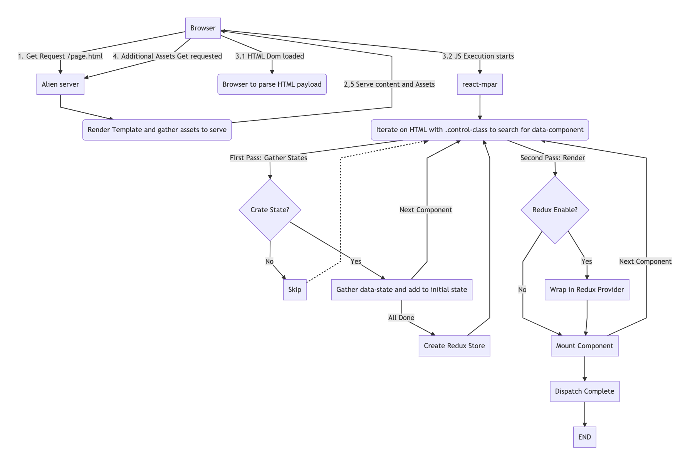

# React MPAR: React Multipage Application Renderer
*Athor:* [Luis E. Nesi M.](luis.nesi@ibm.com)

### Context
**Why React MPAR?**
A very common problem in modern frontend development with react is how to achieve progressive enhancement on sites or web apps where legacy CMS's or web platforms are in place. This is particularly challenging because we need to synchronize server-side alien render from backend with front end rendering with react. At the same time, it may be in the interest of the project to allow the coexistence of legacy server-side rendered (SSR) content from backend with interactive frontend rendered content.

A very common approach to bringing a solution to this problem is [web components](https://www.webcomponents.org/). In a nutshell, web components leverage custom XHTML tags in order to generate micro frontend applications that enhance the standard capabilities of a site with "custom reusable smart/complex components". Is important to clarify that the reusability and complexity aspects of these components may depend on backend services to be put in place so these will not be straight forward that you may expect, however, will enable the inclusion of modern frontend frameworks like react and all its ecosystem/community.

## How it works?
In order to understand how React-MPAR works please consider the following graph.



Lets now take a look to the render process, first the client makes a request via the browser to the alien CMS or Web Platform (1), this web app example AEM, CMS, Drupal, Magento, Wordpress; or any other  will gather the necessary templates an assets based on the path requested example **/route/page.html** and will return back (2) this resources back to the browser via classic HTTP transport. In Web architecture principles for integration projects "The glass" this is where the web platform resolves the URL and retrieves the necessary HTML markup to be delivered to the browser.

Once the initial HTML payload is received by the browser and the HTML Dom (3.1) is initialized in the browser, the natural behavior of these ones is to generate sub sequents HTTP/HTTPS requests (4) to load additional assets needed to render the HTML; example of this assets are CSS, 1st, 2nd and 3th party Js libraries, etc; but most important our App bundles/libraries with React-MPAR.

Immediately after our app withReact-MPAR gets loaded by the browser, the js execution starts (3.2) and the rendered engine will first create the redux store by iterating on the HTML using the control class to search for the HTML elements that are supposed to be replaced by React components.

Lets consider the following HTML marckup and make the assumtion has been generated by a SSR CMS or Web platform.

```html
<!DOCTYPE html>
<html>
  <head>
    <title>The Minimal React Webpack Babel Setup</title>
  </head>
  <body>
    <div class="bx--grid">
        <div class="bx--row">
            <div class="bx--col">
                <h1>Welcome to React Redux MPA Renderer</h1>
                <p>This is Static HTML, Which has been generated by SSR and wont be replace by react</p>
                <hr />
                <div
                  class="mpar-controller-class"
                  data-component="TestComponent"
                  id="12371not_async"
                  data-props="eyJ0aXRsZSI6IlN5bmMgVGVzdCBjb21wb25lbnQiLCJjb3B5IjoidG
                  hpcyBjb21wb25lbnQgaXMgYnVuZGxlIGluIHRoZSBtYWluIGVudHJ5IHBvaW50IG9mIHRoZSBhcHAifQ=="
                ></div>
                <div
                  class="test_class_name"
                  data-component="AsyncTestComponent"
                  id="12371async"
                  data-props="eyJ0aXRsZSI6IkFzeW5jIFRlc3QgQ29tcG9uZW5
                  0IiwiY29weSI6IlRoaXMgaXMgYSBzb2NvbmQgcHJvcCBmcm9tIGJhY2sgZW5kIn0="
                ></div>
            </div>
        </div>
    </div>
    <script src="./index.js"></script>
  </body>
</html>

```
In the above markup we need to focus our attention in the following elements:

**a. HTML Target Element:** The HTML Div element with the class on it ".mpar-controller-class". This element is what we are going to reference as target element. The controller class in this example is "mpar-controller-class". On React-MPAR  this class is the first argument when constructing the renderer. The name of this class can be defined by the developer and is tied to the strategy of bundles and code splits.

```
const renderer=new ReactMPAR(".mpar-controller-class",dictionary,document);
```
Lets keepo the focus on this HTML element:

**b. Data Attribute component:** `data-component="TestComponent` the following HTML attribute is must likely the must important attribnute to be defined and  instructing react-mpar what component inside the dictionary provided to react-mapr has to be render in this target element. **Attention:** if the component is not present in the dictionary react-mpar will throw an error failing to initialize so somethign that will allways needs to keep in mind is we cannot roll off backend components without the React front end counterpart.

**c.Data Attribute Props:** `data-props="e2NvbG9yPScjY2NjJ30="` the following HTML attribute is the second key aspect of react-mpar. So far we  understand how we instruct what component we need to render with component attribute now we need to provide to react what content exatly we need to render inside the desire component. To achive this we will use data-props which which contains all the necesary props for the initial render of the component. You may notice that the content of this attribute may look a bit strange this is because what we are looking at is a base64 encoded json object. If we were to decode the string *e2NvbG9yPScjY2NjJ30=* the result will be:`{color:'#ccc'}`.

**d. Data Attribute State:** `data-state="e30="` Following the same principles of data-props this attribute will contain a base64 encoded json object, the only difference is the role that this data plays into the integration. As we know when working in Redux we can initialize our store with an initial state data this attribute is aiming to do exatly that so we can create the store with an initial state data that comes from the back end server so we dont have to do an initial API call to populate time 0 data. For the case of LFC this technice is not in place we share the state with ```document.ENV.preloadState```

Now the we understand the key elements from the HTML markup, lets go back to the render process. In the step (3.2) of graph 3 we waited for our app bundle to get downloaded and initialized. Once our Bundle entry point get initialized and JS starts to be executed by the browser, the first step that gets executed is `ReactMPAR.createState`. This method will merge a preloadedState to be pass as parameter to React MPAR, with the ones from the components to be render. To achive this, React MPAR search the target dom (6 and 7 on Graph 3) for any element with the controller class and extract the data-state attribute, to then decode it and merge to the preloaded state object to return a single JSON object that has all the preloaded states of the different components of the page. Once we have the initial state from the process above we then create a centralize redux store using standard redux procedures. This store then gets passed to the instance of React MPAR that drives our application with the method `setStore`.

Up to this point, redux is already setup and we have our centralize store ready to go. The next step of the render process is to actually Mount the components in the **targert element**. To achive this, React MPAR  will loop through each of the elements based on the controller class and matching the data-component attribute to the dictonary will mount each of the components in the target div, passing the decoded props and the global store if the component that is beeing render has redux enabled. (step 8 in Graph 3).

Now that we have gone through all the explanation of the render process and what is the capability that React MPAR brings into mix, lets see some example code:

```js
const reactMPAR= new ReactMPAR(
    ".mpar-controller-class",
    dictionary,
    document
);
let preloadedState = reactMPAR.createState({});
const store = createStore(preloadedState);
reactMPAR.setStore(store);
reactMPAR.renderAll();
```

## Concepts

##### Dictonaries
##### Bundles/libraries
##### Controller Class

### DevOps and Integrations
React MPAR is designed to integrate seamlessly with any standard react template or accelerator like [Facebook Create React App](https://facebook.github.io/create-react-app/docs/getting-started). This applications template leverage webpack engine for transpiling JSX and bundling (js/css) artifacts that can be then deployed into your website via any applicable  method depending on the use case; like static CDN, external libraries ([Drupal](https://www.drupal.org/docs/8/theming/adding-stylesheets-css-and-javascript-js-to-a-drupal-8-theme)/[Wordpress](https://developer.wordpress.org/themes/basics/including-css-javascript/)), [clientlibs](http://blogs.adobe.com/experiencedelivers/experience-management/clientlibs-explained-example/) (AEM), Commerce Platforms like [Magento](https://devdocs.magento.com/guides/v2.3/javascript-dev-guide/javascript/custom_js.html)  etc.

In summary, any CMS or web platform can be integrated via their own ways of working around the inclusion of external/custom JS/CSS. Please note that if this seems complex, static CDN can always be an option has long the root paths and services targets are handle correctly during the webpack build process.

#### Webpack considerations
##### Entry Points (Split A)
##### Dynamic Imports Chunks (Split B)
##### Webpack Common Chunks (Split C)


## Demo usage
```
import ReactMPAR from 'react-mpar';

import TestComponent from './TestComponent';

const dictionary = {
    TestComponent: {
        class: TestComponent,
        name: "Test React Component",
        description: "This is a standalone react component can be either a single funcitonal component or a complete SPA",
        reduxEnabled: false,
        createState: false,
    },
};

const renderer=new ReactMPAR(".test_class_name",dictionary,document);

renderer.renderAll();

```
